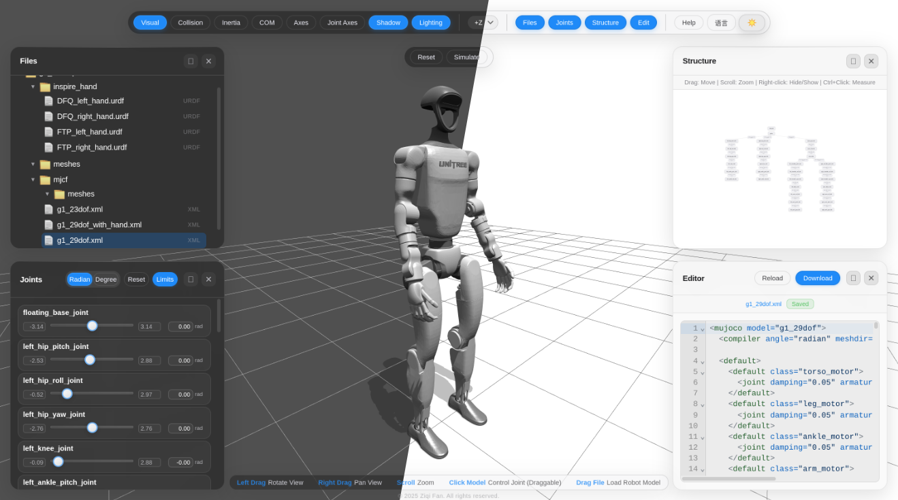

---

# Robot Viewer

[](https://github.com/fan-ziqi/robot_viewer)
[](LICENSE)
[](https://github.com/fan-ziqi/robot_viewer)
[](https://github.com/fan-ziqi/robot_viewer)
[](https://threejs.org/)
[](https://vitejs.dev/)
[](http://viewer.robotsfan.com/)

**Robot Viewer** is a web-based 3D viewer for robot models and scenes. Built on top of [Three.js](https://threejs.org/), it provides an intuitive interface for visualizing, editing, and simulating robots directly in the browser without any installation required. This tool helps you visualize and analyze robot structures, joints, and physical properties.

**Live Demo** (All processing happens in your browser - your models never leave your device):

[](http://viewer.robotsfan.com/)

## Key Features

- **Format Support**: URDF, MJCF (Mujoco XML), USD (partial support)
- **Robot Types**: Serial robot structures (parallel robots not currently supported)
- **Visualization Tools**: Visual/collision geometry, inertia tensors, center of mass, coordinate frames, joint axes, shadows, coordinate system orientation
- **Interactive Controls**: Drag joints in real-time, adjust model poses
- **Measurement Tools**: Measure distances between joints and links with 3D visualization, display X/Y/Z axis projections and total distance, support ground height measurement
- **Code Editor**: Built-in CodeMirror editor with syntax highlighting and live preview
- **Physics Simulation**: Integrated MuJoCo engine for dynamics simulation (MJCF models)
- **Scene Management**: File tree and scene graph visualization with hierarchical structure

## Getting Started

This project uses **pnpm**, but you can also use **npm** or **yarn**.

Clone the repository and install dependencies:

```bash
git clone https://github.com/fan-ziqi/robot_viewer.git
cd robot_viewer
pnpm install
```

Start the development server:

```bash
pnpm run dev
```

Build for production:

```bash
pnpm run build
```

Output will be in the `dist/` directory.

## Contributing

We welcome contributions from the community! Whether you're fixing bugs, adding features, or improving documentation, your help is appreciated.

- **Bug Reports**: Open an [issue](https://github.com/fan-ziqi/robot_viewer/issues) with details
- **Feature Requests**: Discuss ideas in [Discussions](https://github.com/fan-ziqi/robot_viewer/discussions)
- **Pull Requests**: Submit PRs with clear descriptions and tests

## License

This project is licensed under the [Apache License 2.0](LICENSE).

## Acknowledgements

Robot Viewer builds upon the excellent work of the open-source robotics community. This project integrates several powerful open-source projects:

- **[urdf-loader](https://github.com/gkjohnson/urdf-loaders)** - Robust URDF loading for Three.js
- **[mujoco_wasm](https://github.com/zalo/mujoco_wasm)** - MuJoCo physics engine compiled to WebAssembly
- **[usd-viewer](https://github.com/needle-tools/usd-viewer)** - OpenUSD viewer with rich USDStage support
- **[mechaverse](https://github.com/jurmy24/mechaverse)** - Universal 3D viewer for robot models, providing valuable design inspiration

Special thanks to all the maintainers and contributors of these projects for their foundational work.

Parts of this project were developed with the assistance of [Cursor](https://cursor.sh).
